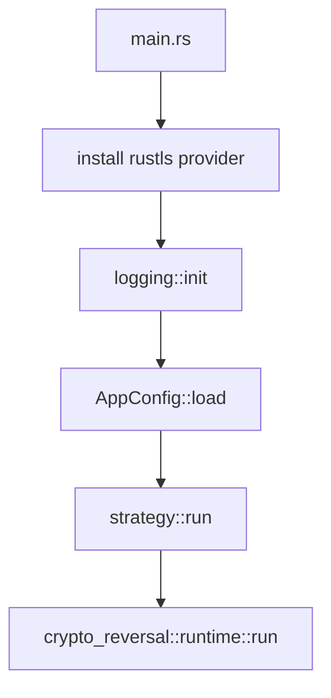
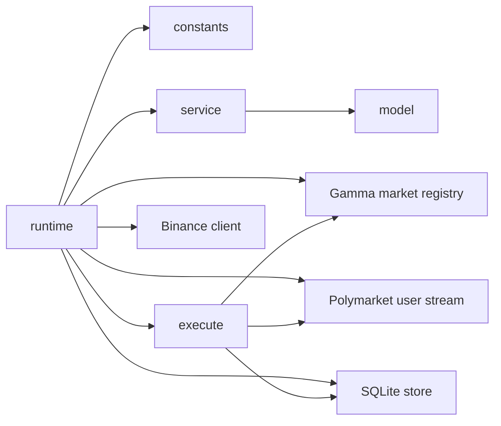
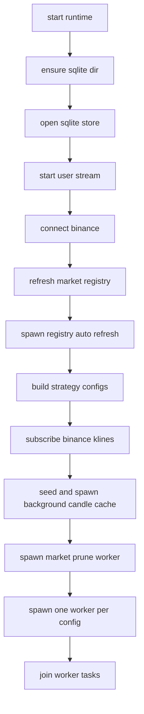
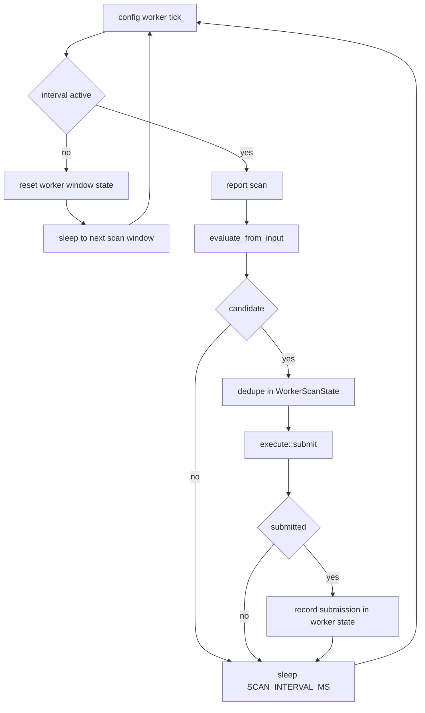
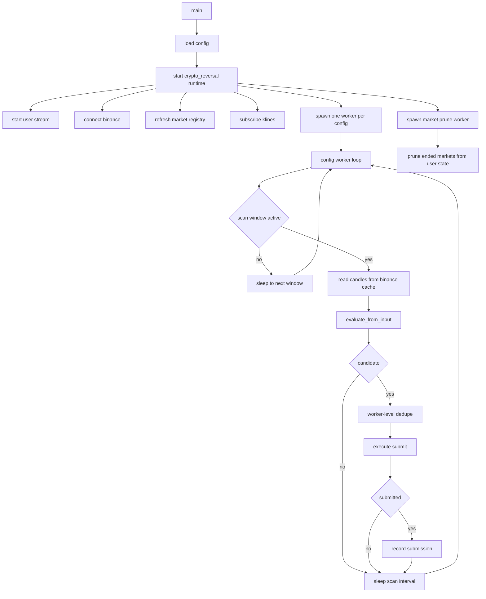

# Crypto Reversal Runtime

这份文档描述当前 Rust 运行时里 `crypto_reversal` 策略的真实实现。

它只覆盖当前代码已经存在的行为：

- 进程启动与配置加载
- 外部数据源和本地状态
- worker 调度
- 信号生成
- 候选筛选
- 下单约束
- 订单与成交落库

不覆盖尚未实现的能力：

- 完整风控系统
- 多策略编排
- 通用 OMS
- 回放 / replay 引擎
- 复杂执行生命周期管理

## 1. 入口与总流程

当前入口在 [src/main.rs](../src/main.rs)。

进程启动顺序：

1. 安装 rustls `CryptoProvider`
2. 初始化日志
3. 加载 `AppConfig`
4. 调用 `strategy::run`
5. 进入 `crypto_reversal::runtime::run`

对应模块关系：

- [src/main.rs](../src/main.rs)
- [src/config.rs](../src/config.rs)
- [src/strategy/mod.rs](../src/strategy/mod.rs)
- [src/strategy/crypto_reversal/runtime.rs](../src/strategy/crypto_reversal/runtime.rs)

## 2. 当前配置

当前配置只保留运行时真正需要的基础项。

`TradingConfig`：

- `PRIVATE_KEY`
- `CLOB_HOST`
- `SYMBOLS`

`RuntimeConfig`：

- `INTERVALS`
- `SQLITE_PATH`
- `SCAN_INTERVAL_MS`
- `ALLOW_ORDER_USDC`
- `REDUCE_ORDER_USDC`
- `CRYPTO_REVERSAL_ORDER_PRICE`

默认值：

- `CLOB_HOST=https://clob.polymarket.com`
- `SYMBOLS=btc`
- `INTERVALS=5m`
- `SQLITE_PATH=data/runtime/events.sqlite3`
- `SCAN_INTERVAL_MS=1000`
- `CRYPTO_REVERSAL_ORDER_PRICE=0`

说明：

- 除 `CRYPTO_REVERSAL_ORDER_PRICE` 外，根目录 `.env` 优先于同名进程环境变量；两者都没有时才回落到代码默认值
- `ALLOW_ORDER_USDC` 和 `REDUCE_ORDER_USDC` 没有代码默认值，必须在根目录 `.env` 或进程环境变量里显式提供
- `SCAN_INTERVAL_MS` 不决定窗口起点
- 它只控制“进入扫描窗口以后”的轮询频率
- `CRYPTO_REVERSAL_ORDER_PRICE` 只读取根目录 `.env`；不会从进程环境变量继承
- `CRYPTO_REVERSAL_ORDER_PRICE` 为 `0` 或未设置时，执行层继续查询 Polymarket 实时买价
- `CRYPTO_REVERSAL_ORDER_PRICE` 大于 `0` 时，`crypto_reversal` 触发后直接按这个固定价格挂单

配置入口见 [src/config.rs](../src/config.rs)。

## 3. 策略架构

`crypto_reversal` 当前拆成 4 个核心模块：

- [constants.rs](../src/strategy/crypto_reversal/constants.rs)
  固定策略参数、扫描窗口、执行常量
- [model.rs](../src/strategy/crypto_reversal/model.rs)
  纯信号模型
- [service.rs](../src/strategy/crypto_reversal/service.rs)
  候选构造、输入订阅、背景过滤
- [execute.rs](../src/strategy/crypto_reversal/execute.rs)
  去重、账户约束、定价、下单、订单落库

`runtime.rs` 负责把这些模块与外部数据源接起来。

## 4. 运行时依赖与本地状态

`runtime::run` 启动后会初始化下面这些依赖。

### 4.1 Polymarket CLOB Client

用途：

- 用私钥完成鉴权
- 查询下单价格
- 提交限价单

代码位置：

- [runtime.rs](../src/strategy/crypto_reversal/runtime.rs)
- [execute.rs](../src/strategy/crypto_reversal/execute.rs)

### 4.2 SQLite Store

用途：

- 落订单事件
- 落成交事件
- 落策略归因

代码位置：

- [sqlite.rs](../src/storage/sqlite.rs)
- [init.sql](../schema/init.sql)

### 4.3 User Stream

用途：

- 启动时同步 open orders 和 positions
- 之后通过 authenticated user WebSocket 增量维护本地账户视图
- 可选写入 SQLite

代码位置：

- [user_stream.rs](../src/polymarket/user_stream.rs)

### 4.4 Binance Client

用途：

- 提供策略信号用的 `kline` 缓存
- 支持本地读取指定 `(symbol, interval)` 的 candles
- 维护 `1h / 4h` 背景周期的本地 HTTP 缓存

代码位置：

- [mod.rs](../src/binance/mod.rs)

### 4.5 Market Registry

用途：

- 通过 Gamma API 发现当前和下一期 market
- 维护 `slug -> [up_asset_id, down_asset_id]`
- 定时刷新

代码位置：

- [market_registry.rs](../src/polymarket/market_registry.rs)

### 4.6 进程内执行状态

当前有两层状态：

- `execute::State`
  维护“已提交 signal window”的全局去重
- `WorkerScanState`
  维护单个 worker 在当前扫描窗口内的 candidate 报告和提交去重

含义：

- 同一 signal window 只允许成功提交一次
- 同一 worker 在一个扫描窗口内不会重复上报或重复提交相同 candidate

代码位置：

- [execute.rs](../src/strategy/crypto_reversal/execute.rs)
- [runtime.rs](../src/strategy/crypto_reversal/runtime.rs)

## 5. 启动阶段流程

`runtime::run` 的初始化顺序如下：

1. 为 SQLite 路径创建父目录
2. 打开 SQLite
3. 启动 `UserClient`
4. 连接 Binance
5. 初始化 `MarketRegistry`
6. 用 Gamma 做一次同步刷新
7. 启动 registry 自动刷新任务
8. 生成 `(symbol, interval)` 对应的策略配置
9. 订阅运行时需要的 Binance `kline`
10. seed 并启动 `1h / 4h` 背景周期缓存刷新
11. 启动 1 个 market prune worker
12. 为每个 `(symbol, interval)` 启动 1 个 config worker
13. 进入 worker join 监听

## 6. Worker 调度逻辑

当前调度不再是单个中央扫描 loop。

运行时现在有两类长期任务：

- 1 个 `run_market_prune_worker`
- `N` 个 `run_config_worker`

其中 `N = symbols × intervals`。

如果配置是：

- `SYMBOLS=btc,eth,sol,xrp`
- `INTERVALS=5m`

那么会启动：

- 1 个 market prune worker
- 4 个 config worker
  - `btc-5m`
  - `eth-5m`
  - `sol-5m`
  - `xrp-5m`

每个 config worker 只负责自己的 `(symbol, interval)`，互不等待。

### 6.1 扫描窗口

扫描不是全时段固定频率执行，只在临近周期结束的窗口内激活：

- `5m`：每个 300 秒周期从 `290s` 开始
- `15m`：每个 900 秒周期从 `890s` 开始

对应常量在 [constants.rs](../src/strategy/crypto_reversal/constants.rs)：

- `M5_SCAN_START_MS = 290_000`
- `M15_SCAN_START_MS = 890_000`

调度实现位于 [runtime.rs](../src/strategy/crypto_reversal/runtime.rs)：

- `interval_is_active`
- `next_scan_delay`
- `scan_start_ms`
- `format_scan_window_key`

### 6.2 Config Worker 行为

每个 `run_config_worker` 的行为是：

1. 判断自己的 interval 当前是否已进入扫描窗口
2. 如果未进入窗口，清空本 worker 的窗口级状态，并 sleep 到最近窗口
3. 如果已经进入窗口，记录 scan
4. 用当前时间生成扫描窗口 key
5. 调 `service::evaluate_from_input`
6. 如果没有 candidate，sleep `SCAN_INTERVAL_MS`
7. 如果有 candidate，先做本窗口内去重
8. 未提交过则直接调用 `execute::submit`
9. 成功提交后记录到本 worker 的已提交集合
10. sleep `SCAN_INTERVAL_MS` 进入下一轮

这里的关键语义是：

- 每个 worker 独立轮询
- 每个 worker 独立评估
- 某个 worker 评估出 candidate 后立刻 submit
- 不再等待其他资产或其他周期先评估完

### 6.3 Market Prune Worker 行为

`run_market_prune_worker` 只负责账户状态修剪，不负责信号或下单。

它的流程是：

1. 读取 registry 中当前活跃 market id 集合
2. 每秒重新读取一次
3. 比较上一次和这一次的差集
4. 对已经结束的 market 调 `user.prune_markets`
5. 如果用户态发生变化，推送 dashboard user state

这样做的作用是：

- 当某期 market 从 registry 中消失后
- 本地 open orders / positions 视图可以及时剔除已结束 market

`user_task` 里的 outcome 同步也依赖 `redeemable=true` 的 positions 快照：

- 先抓官方已结算仓位并写入 SQLite `positions`
- 再根据 `positions.outcome` 和 `cur_price` 推导最终胜方
- 最后仅对 `strategy.outcome = ''` 的记录做补写

## 7. 输入订阅逻辑

运行时对 Binance 的真实输入只有 `kline`。

`service::subscribe_inputs` 会收集策略需要的 `(symbol, interval)`：

- 每个配置都会订阅自己的主周期
- 如果主周期是 `5m`，还会额外订阅 `15m`

这样做是因为：

- `5m` 策略的背景过滤需要 `15m` 已收盘 candles

这一逻辑在 [service.rs](../src/strategy/crypto_reversal/service.rs) 的 `subscribe_inputs` 和内部 `build_inputs`。

## 8. 信号模型

策略信号完全由 Binance candles 推导，纯计算逻辑在 [model.rs](../src/strategy/crypto_reversal/model.rs)。

当前模型参数在 [constants.rs](../src/strategy/crypto_reversal/constants.rs) 的 `default_model_config()`。

默认参数：

- `warmup_bars = 100`
- `rsi_period = 14`
- `bb_period = 30`
- `bb_stddev = 2.0`
- `macd_fast = 12`
- `macd_slow = 26`
- `macd_signal = 9`
- `min_width_pct = 0.2`
- `long_rsi_max = 40.0`
- `short_rsi_min = 60.0`
- `band_pad_pct = 0.0`
- `add_score = 0.32`
- `max_score = 0.5`

模型计算内容：

- RSI
- Bollinger Basis / Upper / Lower / Width
- MACD Histogram

信号判定逻辑：

- `Up`
  价格压到下轨附近，并且 RSI 低于 `long_rsi_max`
- `Down`
  价格抬到上轨附近，并且 RSI 高于 `short_rsi_min`

过滤条件：

- candles 数量小于 `min_bars` 时不出信号
- 布林带宽度低于 `min_width_pct` 时不出信号

打分逻辑：

- 主体基于价格相对布林带位置和 RSI 强度
- MACD 只作为确认和加分项，不是硬过滤

输出结果：

- `side`
- `signal_price`
- `score`
- `size_factor`

## 9. 候选构造与背景过滤

`service::evaluate_from_input` 会把 Binance 输入和 registry 状态转换成执行前候选判断。

流程：

1. 从 Binance 读取主周期 candles
2. 调用 `evaluate_from_registry`
3. 生成 next market slug
4. 去 `MarketRegistry` 查这期 market 是否存在
5. 如果主信号通过，再做背景周期过滤
6. 返回 `Evaluation`

`EvaluationOutcome` 有两类：

- `Candidate`
- `Rejected`

`Candidate` 字段：

- `symbol`
- `interval`
- `market_slug`
- `side`
- `signal_time_ms`
- `score`
- `size_factor`

背景过滤逻辑：

- `5m` 策略看 `15m` 和 `1h`
- `15m` 策略看 `1h` 和 `4h`

背景周期输入来源：

- `15m` 继续走 Binance websocket 本地缓存
- `1h / 4h` 在 runtime 启动时先做一次 HTTP seed
- 之后由 Binance client 内部独立刷新后台缓存
- worker 评估时只读本地缓存，不再在扫描路径上现拉 HTTP

动作有三种：

- `Allow`
- `Reduce`
- `Block`

效果：

- `Allow`：保持原始 `size_factor`
- `Reduce`：下调 `size_factor`
- `Block`：直接丢弃候选

当前行为不是全局选一个 best candidate。

当前行为是：

- 每个 `(symbol, interval)` 配置独立评估
- 某个配置一旦评估出 candidate，就直接进入自己的 `execute::submit`
- 不再等待同轮其他配置
- 也不做全局 best-candidate 竞争

## 10. 执行逻辑

执行入口在 [execute.rs](../src/strategy/crypto_reversal/execute.rs) 的 `submit()`。

### 10.1 执行前检查

按顺序做这些检查：

1. 从 registry 取当前 `market_slug` 对应的 `asset_id`
2. 申请 signal window reservation
3. 检查该 token 是否已有 open buy order
4. 检查该 token 是否已有非 dust 持仓
5. 如果 `CRYPTO_REVERSAL_ORDER_PRICE > 0`，直接使用该固定价格
6. 否则查询 Polymarket 报价
7. 检查价格是否超过上限
8. 计算下单 size

如果任一步失败或不满足条件，返回 `Skipped`，不下单。

### 10.2 去重规则

signal window key 由这些字段组成：

- `symbol`
- `interval`
- `market_slug`
- `side`
- `signal_time_ms`

含义：

- 同一 signal window 只允许成功提交一次

如果提交失败，reservation 会释放。
如果提交成功，reservation 会保留，不再重复提交。

另外，每个 config worker 在当前扫描窗口内还会维护一个本地已提交集合：

- 同一个 candidate 一旦在本窗口内成功提交
- 后续轮询再次扫到它时，不会重复调用 `execute::submit`

这样可以避免在同一窗口内反复命中 `window_already_submitted`。

### 10.3 下单参数

固定执行常量在 [constants.rs](../src/strategy/crypto_reversal/constants.rs)：

- `ALLOW_ORDER_USDC = 4.0`
- `REDUCE_ORDER_USDC = 3.0`
- `ORDER_TYPE = GTC`
- `POLY_MIN_ORDER_SIZE_SHARES = 5.0`
- `POLY_MIN_ORDER_NOTIONAL_USDC = 1.0`
- `MAX_ENTRY_PRICE = 0.54`
- `POSITION_DUST_THRESHOLD = 0.0001`

price 逻辑：

- `CRYPTO_REVERSAL_ORDER_PRICE > 0` 时优先使用固定挂单价
- 否则查询 Polymarket `Buy` 报价
- 两种路径都继续受 `MAX_ENTRY_PRICE` 上限约束

size 逻辑：

- `size_factor < 1.0` 时使用 `REDUCE_ORDER_USDC`
- 否则使用 `ALLOW_ORDER_USDC`
- 再用 `target_notional / price` 算出 shares
- shares 会先按两位小数向下归一
- 然后满足最小股数和最小名义金额约束

### 10.4 下单方向

当前执行层只提交 `Buy`。

原因是：

- `candidate.side` 决定的是买哪一侧 token
- `asset_ids()` 会根据 `Up / Down` 选择对应 token id
- 真正提交给 CLOB 的 side 统一是 `Buy`

## 11. 订单与成交落库

SQLite 当前持久化三类事件：

- `orders`
- `trades`
- `strategy`

表结构见 [init.sql](../schema/init.sql)。

订单事件来源：

- `user_stream` 收到 order message 后转换为 `events::Order`

成交事件来源：

- `user_stream` 收到 trade message 后转换为 `events::Trade`

策略归因来源：

- `execute::submit` 成功后，立即写入 `events::Strategy`

当前可追踪字段包括：

- `strategy`
- `market_slug`
- `order_id`
- `trade_id`
- `side`
- `price`
- `size`
- `event_time`

## 12. 当前完整流程图

## 13. 当前系统边界

当前系统已经具备：

- 固定窗口扫描
- 单策略运行时
- per-config worker 调度
- Binance kline 信号输入
- Gamma next market 映射
- Polymarket 下单
- 本地 open orders / positions 约束
- SQLite 订单、成交和策略归因审计

当前系统还不具备：

- 多策略调度
- 组合级风险控制
- 订单撤改单生命周期
- 通用持仓管理器
- 策略参数热更新
- 完整 replay 与回放审计

## 14. 当前代码文件索引

- [src/main.rs](../src/main.rs)
- [src/config.rs](../src/config.rs)
- [src/strategy/mod.rs](../src/strategy/mod.rs)
- [src/strategy/crypto_reversal/constants.rs](../src/strategy/crypto_reversal/constants.rs)
- [src/strategy/crypto_reversal/model.rs](../src/strategy/crypto_reversal/model.rs)
- [src/strategy/crypto_reversal/service.rs](../src/strategy/crypto_reversal/service.rs)
- [src/strategy/crypto_reversal/execute.rs](../src/strategy/crypto_reversal/execute.rs)
- [src/strategy/crypto_reversal/runtime.rs](../src/strategy/crypto_reversal/runtime.rs)
- [src/polymarket/market_registry.rs](../src/polymarket/market_registry.rs)
- [src/polymarket/user_stream.rs](../src/polymarket/user_stream.rs)
- [src/storage/sqlite.rs](../src/storage/sqlite.rs)
- [schema/init.sql](../schema/init.sql)
